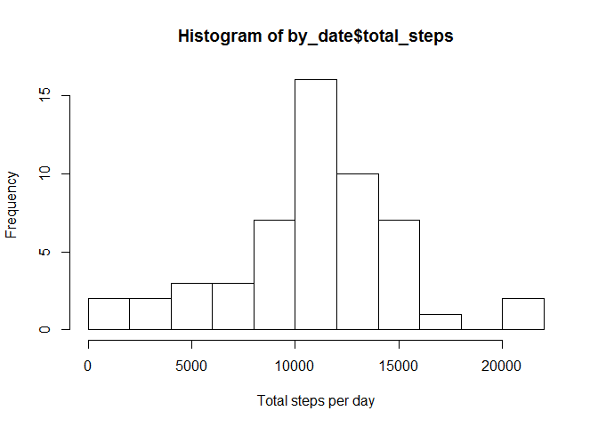
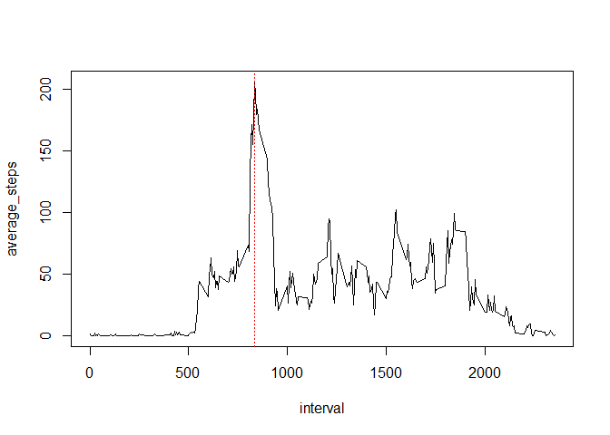
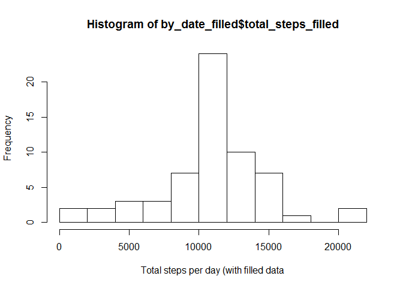
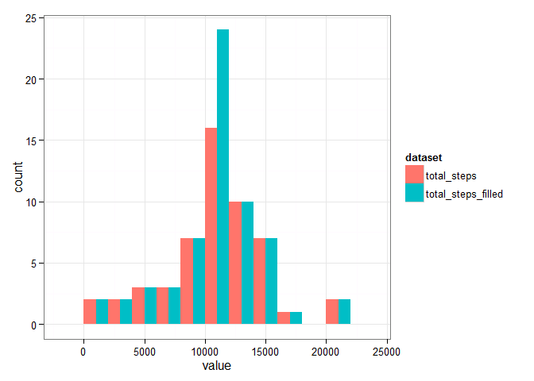
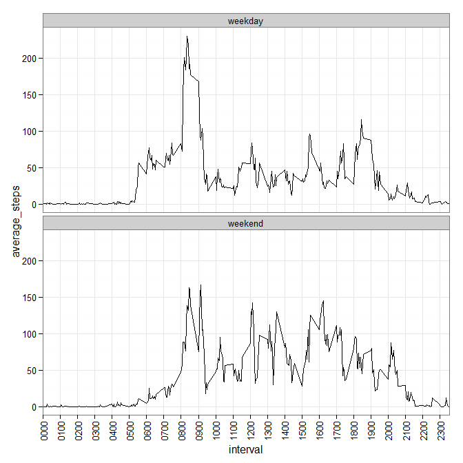

# Reproducible Research: Peer Assessment 1

## Loading and preprocessing the data

```r
# Read data
data<-read.csv(unz("activity.zip", "activity.csv"))
# Format date column
data$date<-as.Date(data$date, format="%Y-%m-%d")
# Quick str on the data
str(data)
```

```
## 'data.frame':	17568 obs. of  3 variables:
##  $ steps   : int  NA NA NA NA NA NA NA NA NA NA ...
##  $ date    : Date, format: "2012-10-01" "2012-10-01" ...
##  $ interval: int  0 5 10 15 20 25 30 35 40 45 ...
```

## What is mean total number of steps taken per day?

```r
library(plyr)
# Compute total steps per day
by_date<-ddply(data, .(date), summarize, total_steps=sum(steps))
# Plot histogram of total steps per day
hist(by_date$total_steps, breaks=10, xlab="Total steps per day")
```

 

Mean and median total number of steps per day are, respectively:

```r
mean(by_date$total_steps, na.rm=TRUE)
```

```
## [1] 10766.19
```

```r
median(by_date$total_steps, na.rm=TRUE)
```

```
## [1] 10765
```

## What is the average daily activity pattern?

```r
library(plyr)
# Compute average steps per interval
by_interval<-ddply(data, .(interval), summarize, average_steps=mean(steps,na.rm=TRUE))
# Find interval with max average
max_<-by_interval[which.max(by_interval$average_steps),]
# Plot average number of steps taken for each interval
plot(by_interval, type='l')
abline(v=max_$interval, col="red", lty=3)
```

 
The 5-minute interval at 835, on average across all days in the dataset, contains the maximum average-steps (206.1698113)

## Inputing missing values

```r
#Look up values to fill in (from interval averages from previous section)
fill_values<-join(data[is.na(data$steps),], by_interval, by="interval")
num_incompletes<-nrow(fill_values)
#Create new dataset with missing values filled in
data_filled<-data
data_filled[is.na(data$steps),]$steps <- fill_values$average_steps
```
There are 2304 rows with missing values in the dataset. We can fill in these missing values by using interval averages calculated from the previous section


```r
library(plyr)
# Compute total steps per day
by_date_filled<-ddply(data_filled, .(date), summarize, total_steps_filled=sum(steps))
# Plot histogram of total steps per day
hist(by_date_filled$total_steps_filled, breaks=10, xlab="Total steps per day (with filled data")
```

 
Mean and median total number of steps per day (after filling in missing values) are, respectively:

```r
mean(by_date_filled$total_steps_filled, na.rm=TRUE)
```

```
## [1] 10766.19
```

```r
median(by_date_filled$total_steps_filled, na.rm=TRUE)
```

```
## [1] 10766.19
```

There is no change to the mean, but the median increased. We can plot histograms of the original and filled datasets as follows:

```r
library(ggplot2)
library(reshape2)
data_both<-join(by_date, by_date_filled, by="date")
data_both<-melt(data_both, id="date", variable.name="dataset")
ggplot(data_both, aes(x=value, fill=dataset))+geom_histogram(binwidth=2000,position="dodge")+theme_bw()
```

 

Inputing missing data caused an increase to the peak count (ie. increase to the total daily number of steps)

## Are there differences in activity patterns between weekdays and weekends?

```r
# Create new factor column
days_weekend=c("Saturday", "Sunday")
data_filled$weekday=weekdays(data_filled$date)
data_filled$daytype=factor(data_filled$weekday %in% days_weekend, labels=c("weekday","weekend"))
# Find total steps per interval
by_interval_daytype<-ddply(data_filled, ~interval+daytype, summarize, average_steps=mean(steps))
# Plot
tick_breaks=seq(0,2400,by=100)
tick_labels=formatC(tick_breaks,width=4,flag="0")
ggplot(by_interval_daytype, aes(x=interval,y=average_steps)) +
    geom_line() +
    facet_wrap(~daytype, nrow=2) +
    scale_x_discrete(labels=tick_labels, breaks=tick_breaks) +
    theme_bw() +
    theme(axis.text.x  = element_text(angle=90,vjust=0.5))
```

 

The 2 plots above show similar peaks around 8-9am timeframe, but with higher average steps for the rest of the day during the weekend
